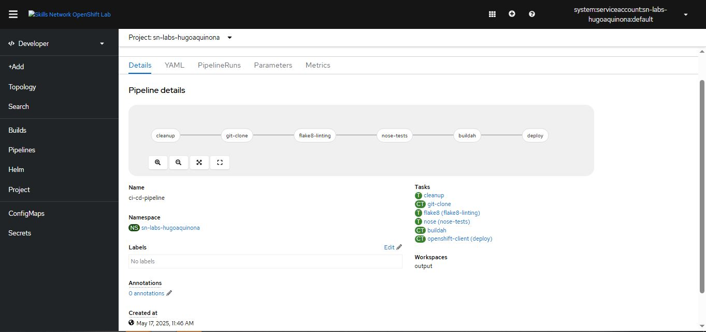

# CI/CD Tools and Practices Final Project Template

This repository contains Final Project´s for **edX** course **IBM CD0215EN - CI/CD Tools and Practices**.

Adjusted by **Hugo Aquino - Panama City, May 2025**.

## Usage

This repository is to be used as a template to create your own repository in your own GitHub account. No need to Fork it as it has been set up as a Template. This will avoid confusion when making Pull Requests in the future.

From the GitHub **Code** page, press the green **Use this template** button to create your own repository from this template.

Name your repo: `ci-cd-final-project`.

## Setup

After entering the lab environment you will need to run the `setup.sh` script in the `./bin` folder to install the prerequisite software.

```bash
bash bin/setup.sh
```

Then you must exit the shell and start a new one for the Python virtual environment to be activated.

```bash
exit
```

## Results

1. Provide the GitHub URL of the `.github/workflows/workflow.yml` file showing the code snippet for the `linting` step.

https://github.com/HugoAquinoNavarrete/ci-cd-final-project/blob/51421f512138b92547a2680460b48df813a8c1a8/.github/workflows/workflow.yml#L20-L23

2. Provide the GitHub URL of the `.github/workflows/workflow.yml` file showing the code snippet for the `test` step.

https://github.com/HugoAquinoNavarrete/ci-cd-final-project/blob/03476b11b74785065805f53bdcc5e5ef6269d138/.github/workflows/workflow.yml#L24-L25

3. Provide the GitHub URL of the `.tekton/tasks.yml` file showing the code snippet for the `cleanup` task.

https://github.com/HugoAquinoNavarrete/ci-cd-final-project/blob/05c10368a85bdcd5b9dcf3a7b11db2c059c04433/.tekton/tasks.yml#L2-L35

4. Provide the GitHub URL of the `.tekton/tasks.yml` file showing the code snippet for the `nose test` task.

https://github.com/HugoAquinoNavarrete/ci-cd-final-project/blob/05c10368a85bdcd5b9dcf3a7b11db2c059c04433/.tekton/tasks.yml#L38-L59

5. Screenshot showing OpenShift PVC details. 


6. Screenshot showing GitHub actions running successfully.


7. Screenshot showing details of the OpenShift Pipeline.



8. Screenshot showing details of the OpenShift Pipeline running successfully.


9. Screenshot of the running application logs from OpenShift console.


 
## License

Licensed under the Apache License. See [LICENSE](/LICENSE)

## Author

Skills Network

## <h3 align="center"> © IBM Corporation 2023. All rights reserved. <h3/>
